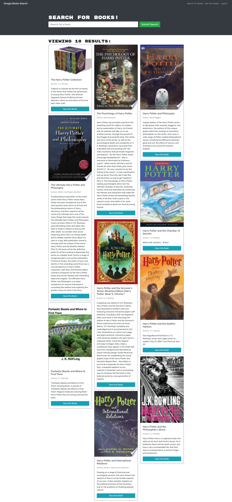
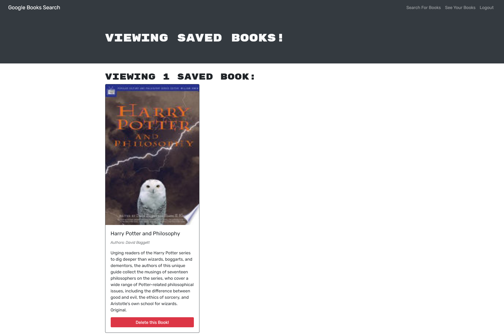
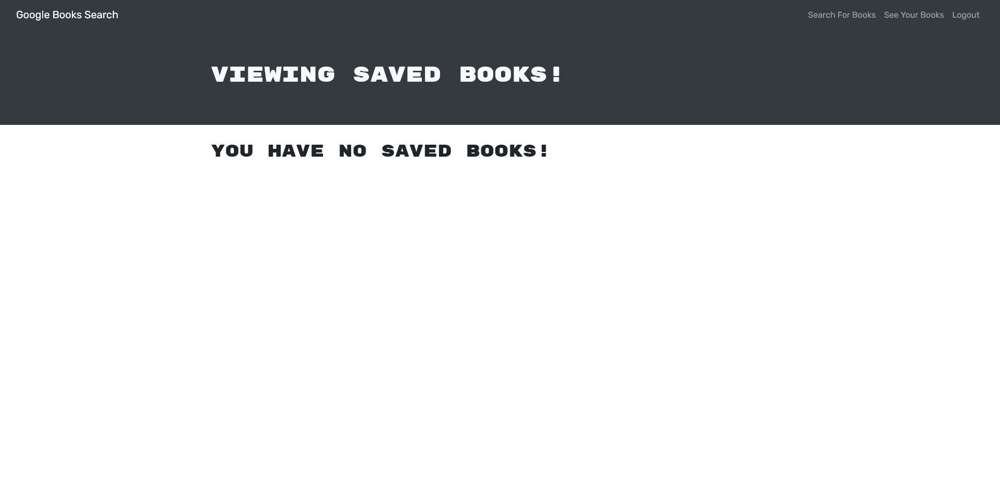

# MERN: Book Search Engine

## Introduction:

Google Books API search engine built with a RESTful API, and refactor it to be a GraphQL API built with Apollo Server. The app was built using the MERN stack with a React front end, MongoDB database, and Node.js/Express.js server and API. It's already set up to allow users to save book searches to the back end.

## Developer Insights:

I am thankful to my instructors at RutgersCodingBootcamp, that they teach me so well and I have crated this coding application.

## Resources
-   [W3SCHOOLS.COM](https://www.w3schools.com/nodejs/)
-   [NODEJS](https://www.w3schools.com/nodejs/)
-   [MONGODB](https://www.w3schools.com/mongodb/)

## How to run:

You can run the application by opening the terminal in your MAC and type following:

NPM RUN START

or

NPM RUN DEVELOP

## ScreenShots

### Homepage

### Saved Book

### Saved Book Deleted

